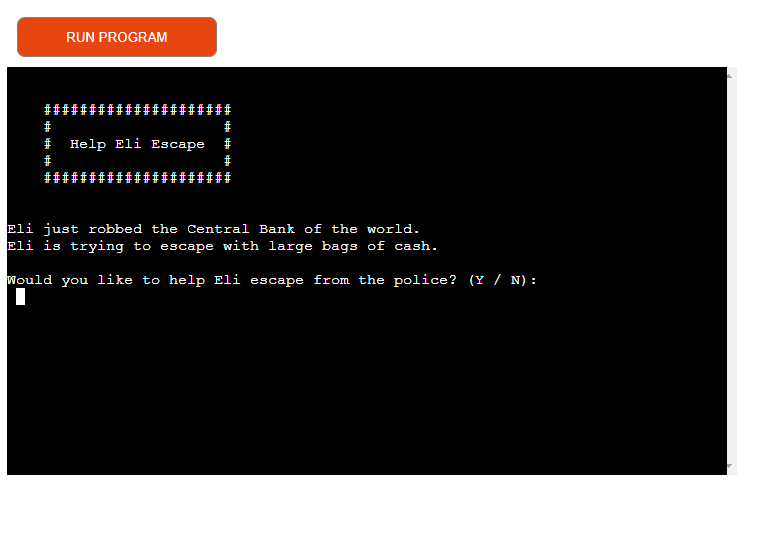
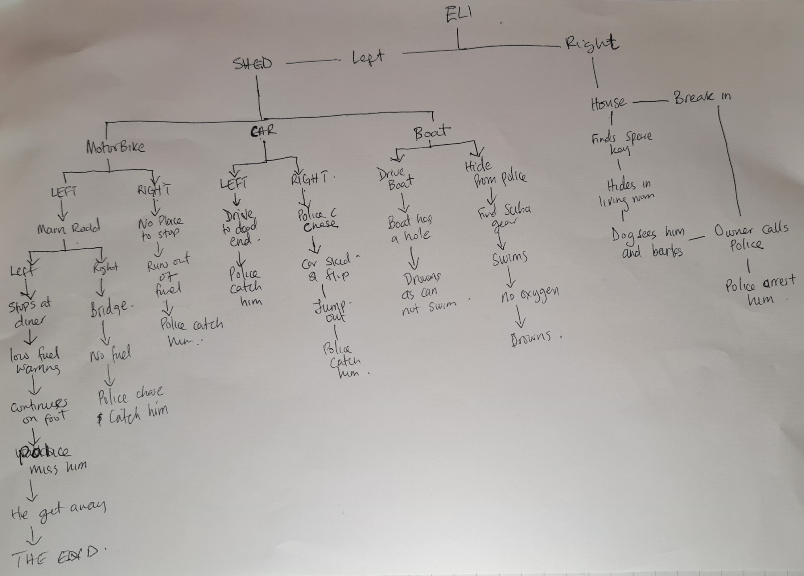
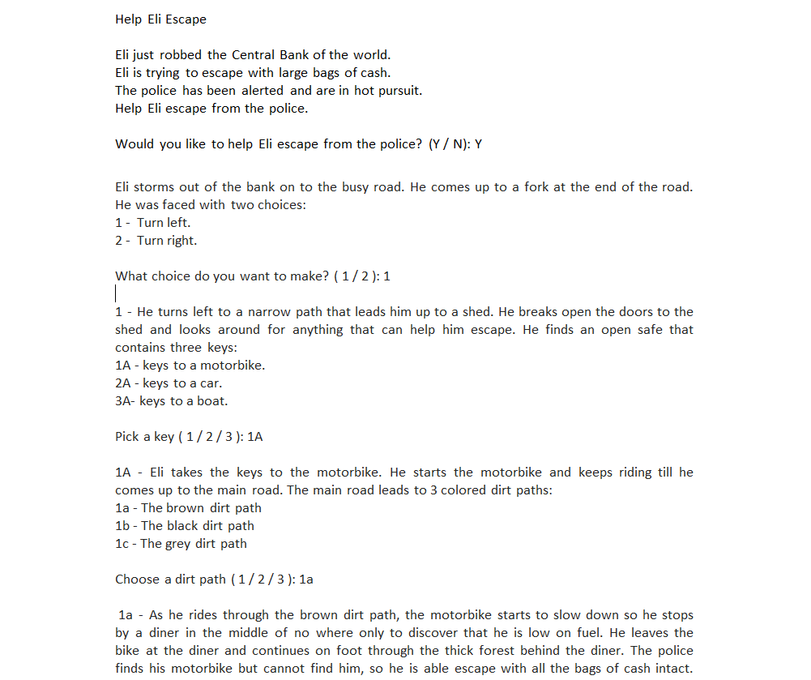
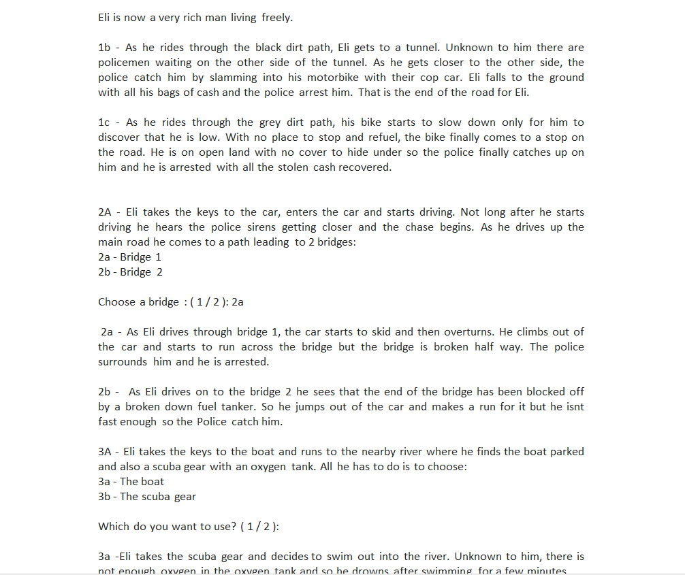
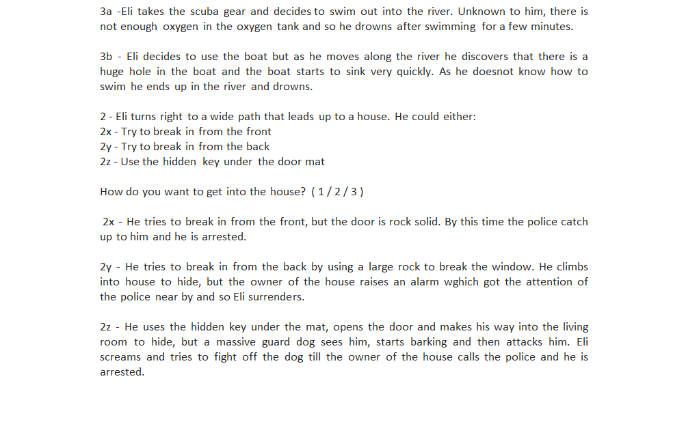
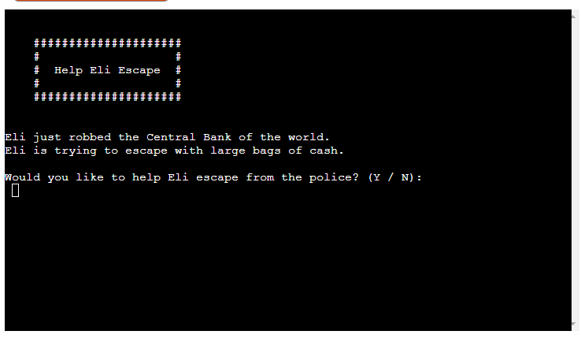
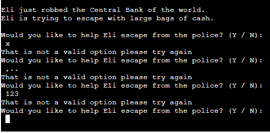
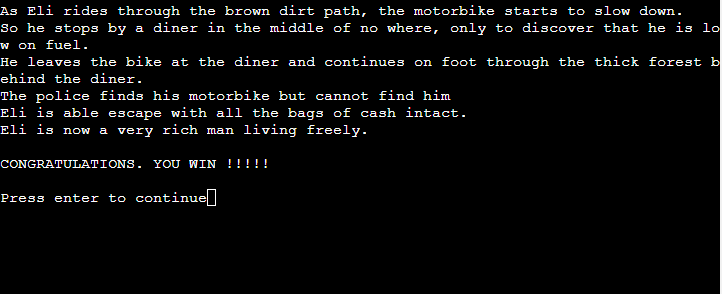
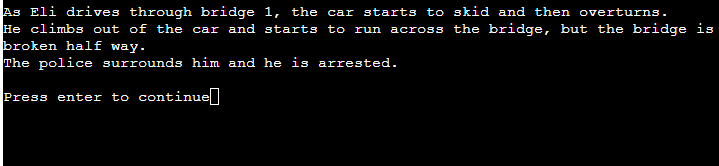
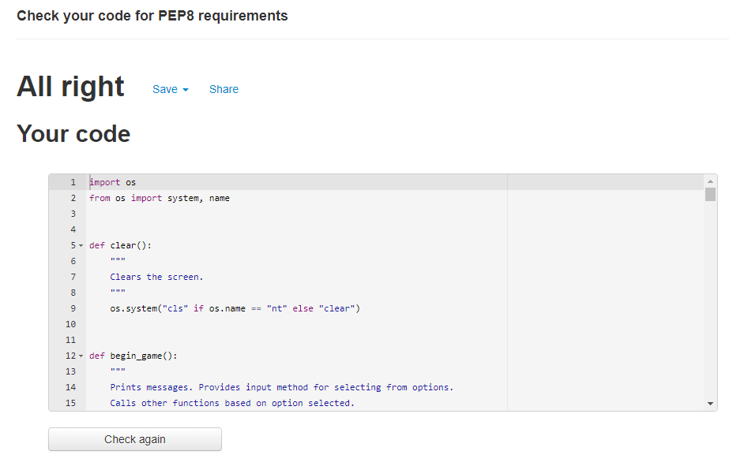

# Help Eli Escape
Help Eli Escape is a text based adventure game also known as interactive fiction (IF). It runs on a terminal. The player uses text input to control the game and the game state is relayed to the player via text output. The story is based on Eli who just robbed a bank and is trying to escape from the police. The goal of the player is to try and navigate Eli through various paths, one of which will eventually lead Eli to freedom.  

## UX

### Terminal based game.
This is a text based adventure game that runs on a terminal. It does not have any graphical user interface. Above the terminal is a "RUN PROGRAM" button that restarts the game. The name of the game "Help Eli Escape" is clearly written in the top left corner of the terminal surrounded by a border. Beneath it is a brief introduction of the game and an input method to start or end the game.

### Wireframes

Below is a sketch of the decision tree I created to help with plotting the paths and choices for the story of the game. Also below are images of the entire story line used in the game. Some of the story lines of the live game are slightly modified from that on the diagram below in order to make the story flow better. 

## Features 

### Existing Features

- __Run Program Button__

  - It is a large and bold button  with the words Run Program written on it.  

- __The Terminal__

  - The name of the game "Help Eli Escape" is clearly written in the top left corner of the terminal surrounded by a border.
 

## Technologies Used

- I used Python programing language to write the code used in making the app.
- I used Gitpod as my code editor.
- I used Github to host my repository.
- I used Git for version control of the app.
- I used Heroku to deploy the live version of the app.

## Testing 

- I confirmed that the run program button was functional.
- I checked that all input methods did not allow wrong user inputs.

- I checked that the clear function was working properly.
- I checked that at the end of each path, the player could choose to restart the game or end it.

 

### Validator Testing 

- Python
  - No errors were found when passing through the [PEP8 online](http://pep8online.com/checkresult)
  

## Deployment
The site was deployed using Heroku. The steps to deploy are as follows:
  * Set up an account on Heroku.
  * From the Heroku dashboard click the “Create new app” button and then name the app.
  * Select your region and then click "Create app".
  * Click on the settings tab and go to the Config Vars section.
  * Click on the "Reveal Config Vars" button.
  * In the field for Key type PORT and in the field for Value type 8000 then click on the Add button.
  * Next go to the Buildpacks section and click on "Add buildpack", select Python and click "Save changes".
  * Click on the "Add buildpack" button again and this time select node.js and click "Save changes".
  * Next click on the Deploy tab and go to the Deployment method section, select Github and click on "Connect to Github".
  * Now search for the Github repository which is named help-eli-escape and then click on "Connect".
  * Next click on "Enable Automatic Deploys".
  * Click on the activity tab and wait for the status to say Build Succeeded and then click on the "Open App" button.

The live link can be found here - https://help-eli-escape.herokuapp.com/

### Local Deployment

To make a local copy of this project, you can clone it by typing the following in your IDE terminal:

- `git clone https://github.com/onabz/Help-Eli-Escape.git`

Alternatively, if using Gitpod, you can click the green Gitpod button, or use [this link](https://gitpod.io/#https://github.com/onabz/Help-Eli-Escape)

## Credits 
 
### Content 

- The layout for my code was from [Simple Python Project | Text-Based Adventure Game: Time Unraveled](https://www.youtube.com/watch?v=ypNFNr72Xe8&t=209s)
- The clear function was from [Stackoverflow](https://stackoverflow.com/questions/2084508/clear-terminal-in-python)

### Acknowledgements

- I would like to thank my Mentor Tim Nelson for his invaluable support all through this project. I would not have been able to put all this together if not for his patience and insight.
- I would like to thank [Student Care](https://learn.codeinstitute.net/ci_support/diplomainsoftwaredevelopmentecommerce/studentcare) for their regular check up on me to ensure that I was always on track to completing this project and to reassure me that they were always available if I needed any help.